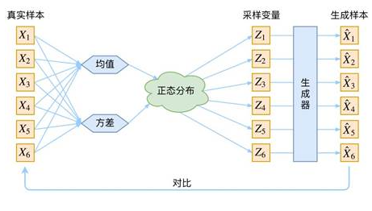
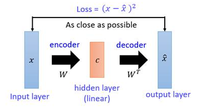
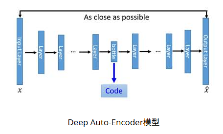
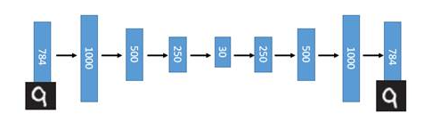
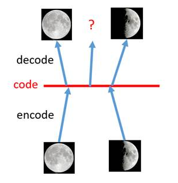
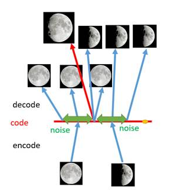
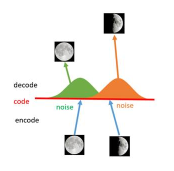
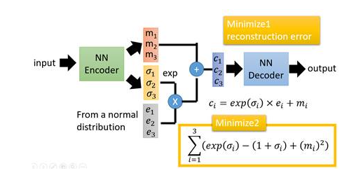

参考笔记：[http://www.gwylab.com/note-vae.html](http://www.gwylab.com/note-vae.html)

VAE 作为一个生成模型，其基本思路是很容易理解的：把一堆真实样本通过编码器网络变换成一个理想的数据分布，然后这个数据分布再传递给一个解码器网络，得到一堆生成样本，生成样本与真实样本足够接近的话，就训练出了一个自编码器模型。那 VAE(变分自编码器)就是在自编码器模型上做进一步变分处理，使得编码器的输出结果能对应到目标分布的均值和方差，如下图所示:

## VAE 的设计思路

VAE 最想解决的问题是什么？如何构造编码器和解码器，使得图片能够编码成易于表示的形态，并且这一形态能够尽可能无损地解码回原真实图像。这似乎听起来与 PCA（主成分分析）有些相似，而 PCA 本身是用来做矩阵降维的：

如图，X 本身是一个矩阵，通过一个变换 W 变成了一个低维矩阵 c，因为这一过程是线性的，所以再通过一个 $W^T$变换就能还原出一个$\hat{x}$，现在我们要找到一种变换 W，使得矩阵 X 与能够尽可能地一致，这就是 PCA 做的事情。在 PCA 中找这个变换 W 用到的方法是 SVD（奇异值分解）算法，这是一个纯数学方法，不再细述，因为在 VAE 中不再需要使用 SVD，直接用神经网络代替。

我们会发现 PCA 与我们想要构造的自编码器的相似之处是在于，如果把矩阵 X 视作输入图像，W 视作一个编码器，低维矩阵 c 视作图像的编码，然后$W^T$和$\hat{x}$分别视作解码器和生成图像，PCA 就变成了一个自编码器网络模型的雏形。现在我们需要对这一雏形进行改进。首先一个最明显能改进的地方是用神经网络代替 W 变换和$W^T$变换，就得到了如下 Deep Auto-Encoder 模型：

这一替换的明显好处是，引入了神经网络强大的拟合能力，使得编码（Code）的维度能够比原始图像（X）的维度低非常多。在一个手写数字图像的生成模型中，Deep Auto-Encoder 能够把一个 784 维的向量（28\*28 图像）压缩到只有 30 维，并且解码回的图像具备清楚的辨认度。

至此我们构造出了一个重构图像比较清晰的自编码模型，但是这并没有达到我们真正想要构造的生成模型的标准，因为，对于一个生成模型而言，解码器部分应该是单独能够提取出来的，并且对于在规定维度下任意采样的一个编码，都应该能通过解码器产生一张清晰且真实的图片。

我们先来分析一下现有模型无法达到这一标准的原因。
假设有两张训练图片，一张是全月图，一张是半月图，经过训练我们的自编码器模型已经能无损地还原这两张图片。接下来，我们在 code 空间上，两张图片的编码点中间处取一点，然后将这一点交给解码器，我们希望新的生成图片是一张清晰的图片（类似 3/4 全月的样子）。但是，实际的结果是，生成图片是模糊且无法辨认的乱码图。一个比较合理的解释是，因为编码和解码的过程使用了深度神经网络，这是一个非线性的变换过程，所以在 code 空间上点与点之间的迁移是非常没有规律的。

如何解决这个问题呢？我们可以引入噪声，使得图片的编码区域得到扩大，从而掩盖掉失真的空白编码点。在给两张图片编码的时候加上一点噪音，使得每张图片的编码点出现在绿色箭头所示范围内，于是在训练模型的时候，绿色箭头范围内的点都有可能被采样到，这样解码器在训练时会把绿色范围内的点都尽可能还原成和原图相似的图片。然后我们可以关注之前那个失真点，现在它处于全月图和半月图编码的交界上，于是解码器希望它既要尽量相似于全月图，又要尽量相似于半月图，于是它的还原结果就是两种图的折中（3/4 全月图）。

给编码器增添一些噪音，可以有效覆盖失真区域。不过这还并不充分，因为在上图的距离训练区域很远的黄色点处，它依然不会被覆盖到，仍是个失真点。为了解决这个问题，我们可以试图把噪音无限拉长，使得对于每一个样本，它的编码会覆盖整个编码空间，不过我们得保证，在原编码附近编码的概率最高，离原编码点越远，编码概率越低。在这种情况下，图像的编码就由原先离散的编码点变成了一条连续的编码分布曲线，如下图所示。

## VAE 的模型架构

上面这张图就是 VAE 的模型架构，我们先粗略地领会一下这个模型的设计思想。

在 auto-encoder 中，编码器是直接产生一个编码的，但是在 VAE 中，为了给编码添加合适的噪音，编码器会输出两个编码，一个是原有编码($m_1$,$m_2$,$m_3$)，另外一个是控制噪音干扰程度的编码($\sigma_1$,$\sigma_2$,$\sigma_3$)，第二个编码其实很好理解，就是为随机噪音码($e_1$,$e_2$,$e_3$)分配权重，然后加上 exp($\sigma_i$)的目的是为了保证这个分配的权重是个正值，最后将原编码与噪音编码相加，就得到了 VAE 在 code 层的输出结果($c_1$,$c_2$,$c_3$)。其它网络架构都与 Deep Auto-encoder 无异。

损失函数方面，除了必要的重构损失外，VAE 还增添了一个损失函数（见上图 Minimize2 内容），这同样是必要的部分，因为如果不加的话，整个模型就会出现问题：为了保证生成图片的质量越高，编码器肯定希望噪音对自身生成图片的干扰越小，于是分配给噪音的权重越小，这样只需要将($\sigma_1$,$\sigma_2$,$\sigma_3$)赋为接近负无穷大的值就好了。所以，第二个损失函数就有限制编码器走这样极端路径的作用，这也从直观上就能看出来，exp($\sigma_i$)-(1+$\sigma_i$)在 $\sigma_i$=0 处取得最小值，于是($\sigma_1$,$\sigma_2$,$\sigma_3$)就会避免被赋值为负无穷大。

上述我们只是粗略地理解了 VAE 的构造机理，但是还有一些更深的原理需要挖掘，例如第二个损失函数为何选用这样的表达式，以及 VAE 是否真的能实现我们的预期设想，即“图片能够编码成易于表示的形态，并且这一形态能够尽可能无损地解码回原真实图像”，是否有相应的理论依据。

## VAE 作用原理
