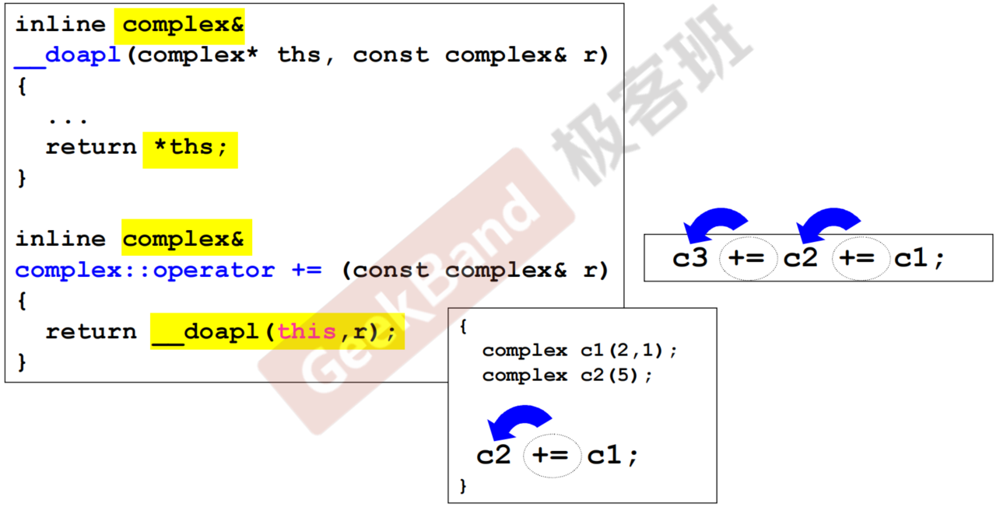
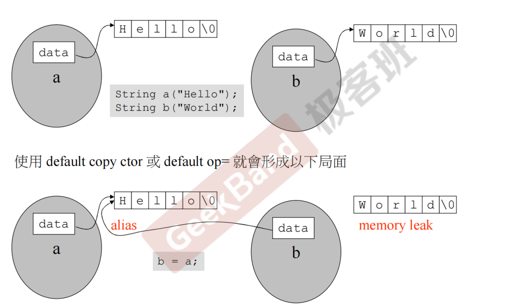

## **构造函数**

:::tip
设计函数的时候需要考虑的事情：

- 函数该不该加 const
- 参数的传递尽量考虑 pass by reference 而不是 value，并且需不需要加 const 也需要考虑
- return 的时候对于返回引用还是返回值也需要考虑
- 数据基本是要放在 private 里面的，绝大部分函数放在 public 里面(要被外界调用)

:::

### 防卫式函数定义

```c++
#ifndef __complex__
#define __complex__

...

#endif
```

### inline 函数

内联函数是 C++的增强特性之一，用来降低程序的运行时间。当内联函数收到编译器的指示时，即可发生内联：把内联函数的函数体在编译器预处理的时候替换到函数调用处（加副本），这样代码运行到这里时候就不需要花时间去调用函数（减少了函数调用过程的入栈出栈等开销），注意这种替代行为发生在**编译阶段而非程序运行阶段**，且对内联函数进行任何修改，都需要重新编译函数的所有客户端，因为编译器需要重新更换一次所有的代码，否则将会继续使用旧的函数。==比如说函数在对象本体里面定义而不仅仅是在对象内部声明的情况==可以叫 inline 函数（是否 inline 函数最终由编译器决定）。

**优点**：

- 通过避免函数调用所带来保存现场、变量弹栈压栈、跳转新函数、存储函数返回值、执行完返回原现场等开销，提高了程序的运行速度
- 通过将函数声明为内联，你可以把函数定义放在头文件内。编译器需要把 inline 函数体替换到函数调用处，所以==编译器必须要知道 inline 函数的函数体是啥==，所以要将 inline 函数的函数定义和函数声明一起写在头文件中，便与编译器查找替换。

**缺点**：

- 因为代码的替换扩展，内联函数会增大可执行程序的体积，进而导致程序变得更慢
- C++内联函数的展开是中编译阶段，这就意味着如果你的内联函数发生了改动，那么就需要重新编译代码

### Singleton（单例类）

==保证每一个类仅有一个实例，并为它提供一个全局访问点。==

功能：

- 保证程序的正确性，使得最多存在一种实例的对象不会被多次创建。
- 提高程序性能，避免了多余对象的创建从而降低了内存占用。

```c++

class Singleton
{
private:
    static Singleton* sin;
    Singleton(){}

public:
    static Singleton* getInstance()
    {
        if(sin == nullptr)
            sin = new Singleton();
        return sin;
	}
}


```

:::tip
首先，我们将构造函数声明为私有，这样就防止了任何人用 new 关键字创建对象，而只能调用函数的 getInstance 函数来获取单例指针。然后，检查是否有已经存在的对象，如果有，直接返回该指针，如果没有，创建对象并返回指针。(_单线程程序_)
:::

## **参数传递与返回值**

### 相同 class 的各个 objects 互为友元（friends）

```c++
class complex
{
public:
    complex(double r = 0, double i = 0): re(r), im(i){}
    int func(const complex& param){
        return param.re + param.im;
    }

private:
    double re, im;
}
···
{
    complex c1(1,2);
    complex c2;

    c2.func(c1); // 这个是可以调用的
}
```

## 操作符重载与临时对象

### 操作符重载-成员函数（this 指针）

所有的成员函数（除静态成员函数）都带有一个隐藏的 this 参数.作为成员函数的调用者，this 不能在参数列写出来，但是在函数中可以使用。

::: note
\_\_doapl():标准库里的复数的设计代码，所有的二元重载运算符都是类似
:::

==**传递者无需知道接受者是以 reference 形式接收**==



对于下述第二种情况，因为是要做连加操作，因此必须是`inline complex&`操作而不是`inline void`操作。

### 操作符重载-非成员函数

temp object(临时对象) typename();
类似于`return complex(real(x) + y, imag(x))`这种。绝不可以返回引用，因为他们返回的是个本地对象(local object)。

### 左移运算符重载

主要见黑马笔记，注意返回引用（ostream&）

## 拷贝构造，拷贝复制，析构

```c++
class String
{
public:
   String(const char* cstr=0);
   String(const String& str);                  //拷贝构造
   String& operator=(const String& str);       //拷贝赋值
   ~String();
   char* get_c_str() const { return m_data; }  //这边传回的是指针，注意一下
private:
   char* m_data;
};
```


:::note
**浅拷贝会导致信息泄露问题**,因此需要深拷贝

```c++
inline
String::String(const String& str)
{
   m_data = new char[ strlen(str.m_data) + 1 ];
   strcpy(m_data, str.m_data);
}
```

:::

==对于拷贝赋值函数，有==

```c++
inline
String& String::operator=(const String& str)
{
   if (this == &str) //如果没有这一步，在进行c1 = c1的时候，下一步的delete操作会直接把内容清掉，后续操作无法进行，不仅仅是效率问题
      return *this;

   //需要先把原先的的内存（比如c1 = c2 中的c1）清空，再重新生成和c2相同大小的空间
   delete[] m_data;

   m_data = new char[ strlen(str.m_data) + 1 ];
   strcpy(m_data, str.m_data);
   return *this;
}
```

### output 函数

```c++
ostream& operator<<(ostream& os, const String& str)
{
   os << str.get_c_str();
   return os;
}
```

## 堆、栈与内存管理
