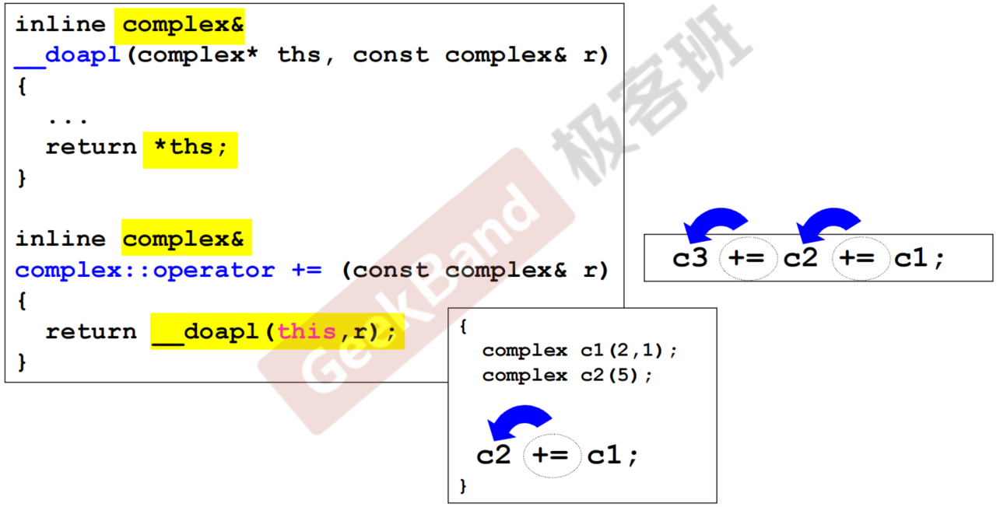
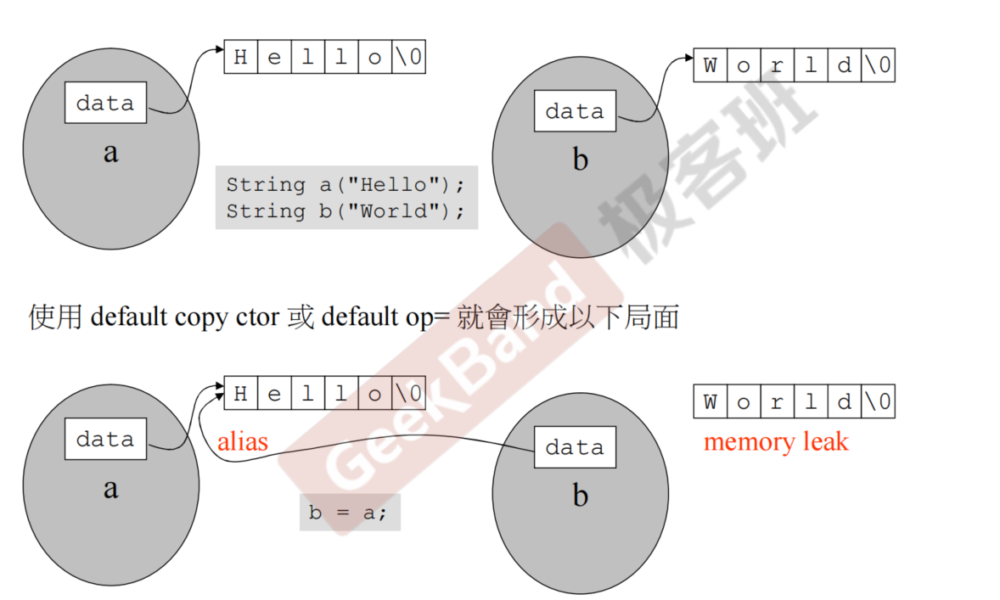
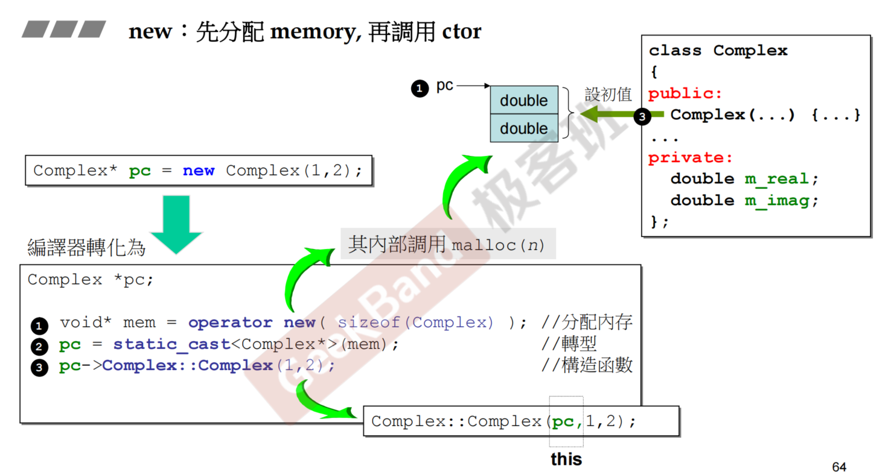
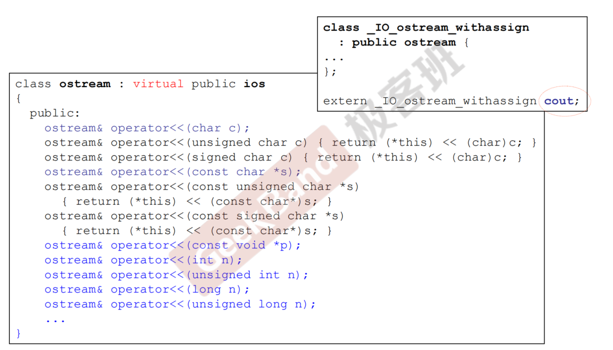
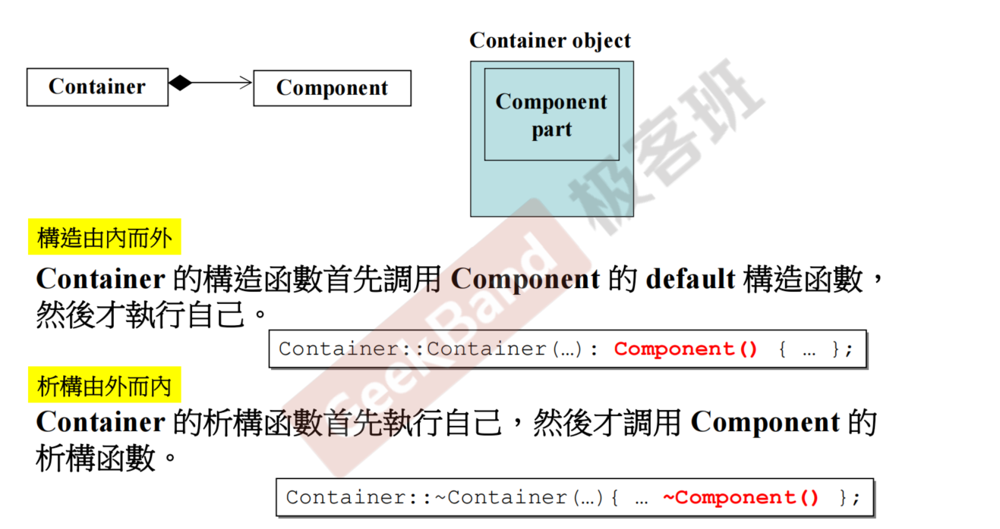
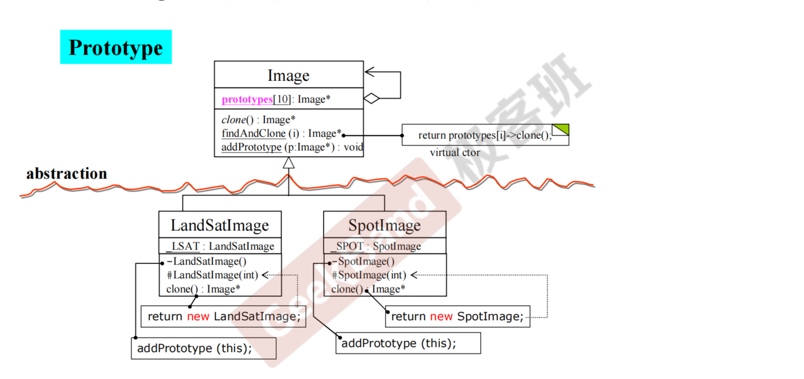

## **构造函数**

:::tip
设计函数的时候需要考虑的事情：

- 函数该不该加 const
- 参数的传递尽量考虑 pass by reference 而不是 value，并且需不需要加 const 也需要考虑
- return 的时候对于返回引用还是返回值也需要考虑
- 数据基本是要放在 private 里面的，绝大部分函数放在 public 里面(要被外界调用)

:::

### 防卫式函数定义

```cpp
#ifndef __complex__
#define __complex__

...

#endif
```

### inline 函数

内联函数是 C++的增强特性之一，用来降低程序的运行时间。当内联函数收到编译器的指示时，即可发生内联：把内联函数的函数体在编译器预处理的时候替换到函数调用处（加副本），这样代码运行到这里时候就不需要花时间去调用函数（减少了函数调用过程的入栈出栈等开销），注意这种替代行为发生在**编译阶段而非程序运行阶段**，且对内联函数进行任何修改，都需要重新编译函数的所有客户端，因为编译器需要重新更换一次所有的代码，否则将会继续使用旧的函数。==比如说函数在对象本体里面定义而不仅仅是在对象内部声明的情况==可以叫 inline 函数（是否 inline 函数最终由编译器决定）。

**优点**：

- 通过避免函数调用所带来保存现场、变量弹栈压栈、跳转新函数、存储函数返回值、执行完返回原现场等开销，提高了程序的运行速度
- 通过将函数声明为内联，你可以把函数定义放在头文件内。编译器需要把 inline 函数体替换到函数调用处，所以==编译器必须要知道 inline 函数的函数体是啥==，所以要将 inline 函数的函数定义和函数声明一起写在头文件中，便与编译器查找替换。

**缺点**：

- 因为代码的替换扩展，内联函数会增大可执行程序的体积，进而导致程序变得更慢
- C++内联函数的展开是中编译阶段，这就意味着如果你的内联函数发生了改动，那么就需要重新编译代码

### Singleton（单例类）

==保证每一个类仅有一个实例，并为它提供一个全局访问点。==

功能：

- 保证程序的正确性，使得最多存在一种实例的对象不会被多次创建。
- 提高程序性能，避免了多余对象的创建从而降低了内存占用。

```cpp

class Singleton
{
private:
    static Singleton* sin;
    Singleton(){}

public:
    static Singleton* getInstance()
    {
        if(sin == nullptr)
            sin = new Singleton();
        return sin;
    }
}


```

:::tip
首先，我们将构造函数声明为私有，这样就防止了任何人用 new 关键字创建对象，而只能调用函数的 getInstance 函数来获取单例指针。然后，检查是否有已经存在的对象，如果有，直接返回该指针，如果没有，创建对象并返回指针。(_单线程程序_)
:::

::: note
把静态变量放在 private 里：

```cpp
class A {
public:
    static A& getInstance() {return a;}   //通过这个指令来调用A
    setup() {...}

private:
    A();
    A(const A& rhs);
    static A a;   //外界无法创建对象
}

...

A::getInstance().setup()
```

但是这样==A 会一直存在，哪怕没有人调用，会造成资源的浪费==，因此有以下优化：

```cpp
class A {
public:
    static A& getInstance();    //通过这个指令来调用A
    setup() {...}

private:
    A();
    A(const A& rhs);
       //外界无法创建对象
}

...

A& A::getInstance(){
    static A a;
    return a;
}
```

要用直接用 getInstance() 即可
:::

## **参数传递与返回值**

### 相同 class 的各个 objects 互为友元（friends）

```cpp
class complex
{
public:
    complex(double r = 0, double i = 0): re(r), im(i){}
    int func(const complex& param){
        return param.re + param.im;
    }

private:
    double re, im;
}
···
{
    complex c1(1,2);
    complex c2;

    c2.func(c1); // 这个是可以调用的
}
```

## 操作符重载与临时对象

### 操作符重载-成员函数（this 指针）

所有的成员函数（除静态成员函数）都带有一个隐藏的 this 参数.作为成员函数的调用者，this 不能在参数列写出来，但是在函数中可以使用。

::: note
\_\_doapl():标准库里的复数的设计代码，所有的二元重载运算符都是类似
:::

==**传递者无需知道接受者是以 reference 形式接收**==



对于下述第二种情况，因为是要做连加操作，因此必须是`inline complex&`操作而不是`inline void`操作。

### 操作符重载-非成员函数

temp object(临时对象) typename();
类似于`return complex(real(x) + y, imag(x))`这种。绝不可以返回引用，因为他们返回的是个本地对象(local object)。

### 左移运算符重载

主要见黑马笔记，注意返回引用（ostream&）

## 拷贝构造，拷贝复制，析构

```cpp
class String
{
public:
   String(const char* cstr=0);
   String(const String& str);                  //拷贝构造
   String& operator=(const String& str);       //拷贝赋值
   ~String();
   char* get_c_str() const { return m_data; }  //这边传回的是指针，注意一下
private:
   char* m_data;
};
```


::: note
**浅拷贝会导致信息泄露问题**,因此需要深拷贝

```cpp
inline
String::String(const String& str)
{
   m_data = new char[ strlen(str.m_data) + 1 ];
   strcpy(m_data, str.m_data);
}
```

:::

==对于拷贝赋值函数，有==

```cpp
inline
String& String::operator=(const String& str)
{
   if (this == &str) //如果没有这一步，在进行c1 = c1的时候，下一步的delete操作会直接把内容清掉，后续操作无法进行，不仅仅是效率问题
      return *this;

   //需要先把原先的的内存（比如c1 = c2 中的c1）清空，再重新生成和c2相同大小的空间
   delete[] m_data;

   m_data = new char[ strlen(str.m_data) + 1 ];
   strcpy(m_data, str.m_data);
   return *this;
}
```

### output 函数

```c++
ostream& operator<<(ostream& os, const String& str)
{
   os << str.get_c_str();
   return os;
}
```

## 堆、栈与内存管理

### new, delete 的深层原理



::: note
对于 delete 操作，首先会进行析构函数~Complex(), 然后再释放内存(operate delete(com))
:::

## 扩展补充： 类模板、模板对象、及其他

### static

::: note
对于`complex c1; cout << c1.real();`的本质其实是`complex c1; cout << complex::real(&c1);`
:::

而对于 static 变量（函数），他会被编译器单独放在一个区域，不会具体被分配到某一个对象中，因此你可以直接用`complex::function()`来调用。

::: tip
**对于静态局部变量无链接 (只能在定义它的块内访问，无法被其他函数或文件直接引用)这句话的理解**

- ==全局变量==就像是公共电话号码簿上的一个公开号码（比如消防局 119）。任何人都知道这个名字（fire_department），在任何地方（任何文件）只要查一下电话簿(==用 extern 声明==)，就可以拨打这个号码。这就是有链接（外部链接）。

- ==静态全局变量==就像是一个公司内部的内部通讯录。只有本公司（本文件）的员工才知道这个短号（比如 #600），公司外部的人根本不知道这个短号的存在，也无法拨打。这就是内部链接。

- ==静态局部变量==就像是你手机里存储的一个号码，并且你只把它命名为“A”。只有你（所在的函数）知道“A”代表谁，并且能用这个“A”来打电话。你无法告诉别人“你打这个叫‘A’的人的电话”，因为别人（其他函数）根本不知道你的“A”具体指的是谁。你的“A”和外界没有任何关联。但是，这个叫“A”的人一直存在（生命周期全局），你每次打电话都能找到同一个人，并且可以和他连续聊天（值会保持）。

这就是 “无链接”：它就是一个纯粹的内部别名，与外界完全隔绝，无法被直接引用。

```cpp
// file.c
#include <stdio.h>

// 全局变量 - 有外部链接
// 编译器会把这个变量名 "global_var" 记录到符号表中，并标记为"可供其他文件查找"
int global_var = 10;

// 静态全局变量 - 有内部链接
// 编译器把 "static_global_var" 记录到符号表，但标记为"仅本文件可用"
static int static_global_var = 20;

void my_function() {
    // 静态局部变量 - 无链接
    // 编译器会分配一个永久内存给它，但变量名 "static_local_var"
    // **不会被放入可供外部查找的符号表**。
    // 它只是一个只在 my_function 内部有效的标识符。
    static int static_local_var = 0;
    static_local_var++;
    printf("Static local: %d\n", static_local_var);
}

int main() {
    my_function();
    my_function();
    return 0;
}
```

现在，我们尝试在另一个文件中“链接”它：

```cpp
// another_file.c

// 声明：告诉编译器，“请去其他文件找找这个叫 global_var 的变量”
extern int global_var; // ✅ 正确！链接器会在 file.c 中找到它，链接成功。

// extern int static_global_var; // ❌ 编译可能通过，但链接失败！
                                // 链接器在 file.c 中找到了 static_global_var，
                                // 但发现它被标记为"内部链接（static）"，拒绝让另一个文件访问它。

// extern int static_local_var;  // ❌ 这甚至毫无意义！
                                // 链接器在 file.c 的符号表里**根本找不到**名叫 static_local_var 的全局变量。
                                // 因为 static_local_var 是“无链接”的，它的名字没有被暴露给链接器。

void some_other_function() {
    int x = global_var; // ✅ 可以正常使用
    // int y = static_global_var; // ❌ 无法使用
    // int z = static_local_var;  // ❌ 更无法使用
}
```

:::

### cout 的原理



### namespace 的原理

隔离作用域：命名空间本质上是一个作用域。它将名称“包裹”起来，形成独立的区域。

`using` 指令的作用：`using namespace std`; 相当于对编译器说：“在当前作用域（通常是整个文件）内，将 `std` 命名空间中的所有名称一次性注入到全局作用域中。” 编译器在查找一个名称时，会先在当前作用域找，如果找不到，就会去这些被“注入”的名称里找。

::: tip
缺点:

- 命名污染：它把 `std` 中成百上千个名字全部引入了全局命名空间，大大增加了与你自己或其他库定义的名字发生冲突的可能性。

```cpp
#include <iostream>
#include <algorithm> // 包含 std::count
using namespace std;

int count = 0; // 我自己定义了一个全局变量 count

int main() {
    cout << count; // 歧义！编译器困惑了：这个count是全局变量count，还是std::count？
    return 0;
}
```

- 在头文件中是绝对禁止的：如果你在头文件里写了 `using namespace std`;，那么所有包含了这个头文件的源文件都会被迫引入整个 `std` 命名空间。这相当于一种“污染扩散”，后果不可预测，而且非常难以调试。

:::

## 组合与继承



## 委托相关设计

### 委托+继承

对未来 class 名称留位置（框架的构成）

其中,==LSAT==代表静态对象 -LangSatImage 代表 `private` 的初始构造函数 ,`#`代表 `protected`
