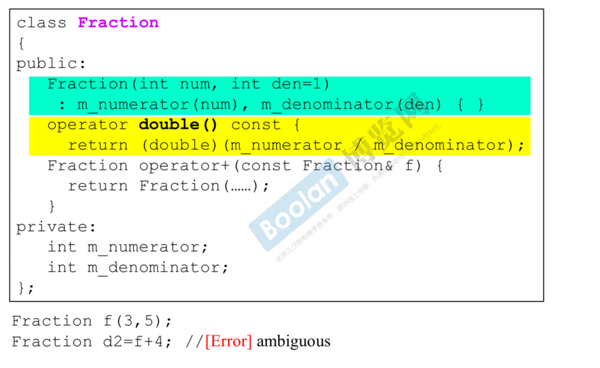
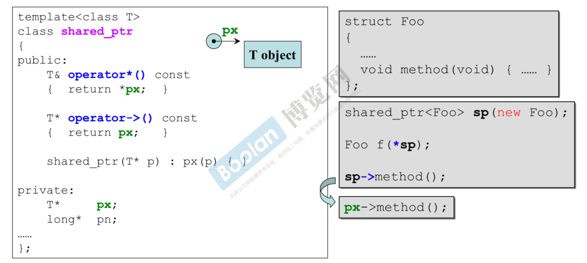

## 转化函数

### 1.conversion function

**转换函数是类的成员函数，它告诉编译器：我的类对象可以如何被转换成其他类型**。当编译器在代码中需要一个类型 `X`，但你提供的却是一个类 `A` 的对象时，如果类 `A` 定义了到类型 `X` 的转换函数，编译器就会==自动地、隐式地==调用这个函数来完成转换。

转换函数的语法非常独特，**没有返回值类型**，函数名就是目标类型：

```cpp
#include <iostream>

class Fraction {
private:
    int m_numerator;   // 分子
    int m_denominator; // 分母

public:
    Fraction(int num, int den = 1)
        : m_numerator(num), m_denominator(den) {}

    // Conversion Function: Fraction -> double
    // 定义了如何将 Fraction 对象转换为 double 值
    operator double() const {
        // 转换逻辑：分子除以分母
        return static_cast<double>(m_numerator) / m_denominator;
    }

    void print() const {
        std::cout << m_numerator << "/" << m_denominator;
    }
};

int main() {
    Fraction f(3, 4); // 表示 3/4

    // 场景 1: 赋值给 double 变量
    // 编译器发现需要 double，但提供了 Fraction
    // 于是自动调用 operator double()
    double d = f;
    std::cout << d << std::endl; // 输出 0.75

    // 场景 2: 在需要 double 的表达式里
    // 这里发生了隐式转换：f -> double -> 参与加法运算
    double sum = f + 1.5;
    std::cout << sum << std::endl; // 输出 2.25 (0.75 + 1.5)

    // 场景 3: 传递给参数类型为 double 的函数
    std::cout << "The value is: " << f << std::endl;
    // cout 的 << 操作符有处理 double 的重载版本，
    // 但没有处理 Fraction 的版本。
    // 所以编译器隐式调用 operator double()，然后输出 0.75

    return 0;
}
```

::: tip
转换函数是==隐式调用==的，编译器会在任何需要的地方**自动**使用它。这虽然方便，但有时会导致令人困惑的代码和意想不到的行为。
:::

### 2.non-explicit-one-argument ctor


他的思路与`1.`相反，但是如果将两个通常不能放在一起，不然会导致编译器产生歧义。


==这个例子既可以表示 0.6+4(因为黄色部分)，也可以表示 f(3,5) + f(4,1)（因为有加法运算符重载）==

### 3.explicit-one-argument ctor


因为 4 **无法隐性构造**，因此这条语句无法成立。

::: note
**explicit 关键字**：

`explicit` 的关键作用就两个字：“禁止”。它告诉编译器：“这个转换只能由程序员明确地、直接地调用，你不能自作主张地悄悄使用它。”,其用途有两个：

- 用于构造函数
- 用于类型转换函数 (C++11+)

当一个构造函数可以被用一个参数调用时（它可能只有一个参数，或者有多个参数但除第一个外都有默认值），它就是一个**转换构造函数**。默认情况下，编译器会用它来进行**隐式转换**。==`explicit` 就是用来禁用这种隐式转换的。==

```cpp
class MyString {
private:
    char* m_data;
public:
    // 使用 explicit 关键字，禁止隐式转换
    explicit MyString(const char* str) {
        std::cout << "Constructor called: " << str << std::endl;
        // ... 分配内存并复制字符串的逻辑
    }

    void print() const {
        std::cout << m_data << std::endl;
    }
};

void printString(MyString s) {
    s.print();
}

int main() {
    // MyString s1 = "Hello";   // 错误！编译失败，不允许隐式转换
    MyString s1("Hello");       // 正确！显式调用构造函数
    MyString s2 = MyString("Hello"); // 正确！显式创建

    // printString("World");    // 错误！编译失败，不允许隐式转换
    printString(MyString("World")); // 正确！显式转换

    return 0;
}
```

:::

### 4.代理

## 智能指针

### 1.pointer-like classes


对于这种智能指针，里面`operator*` 和`operator->`一定都是这样定义的。

### 2.迭代器
